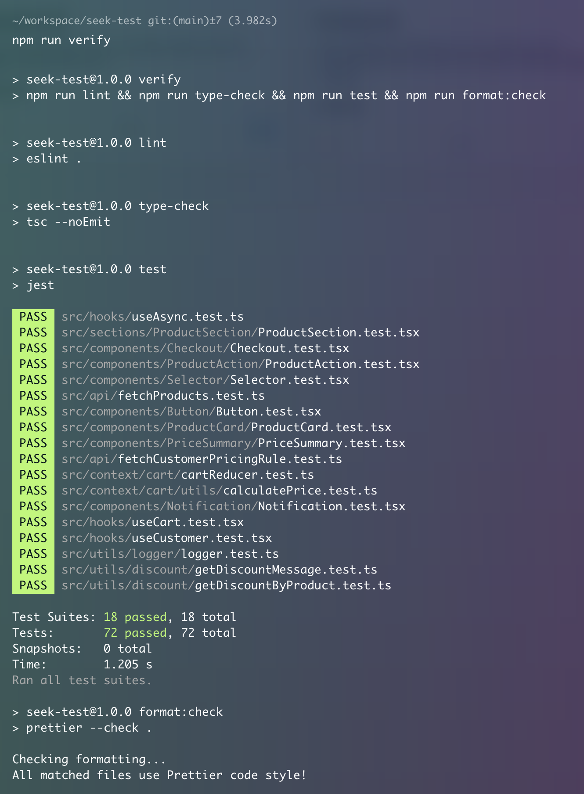
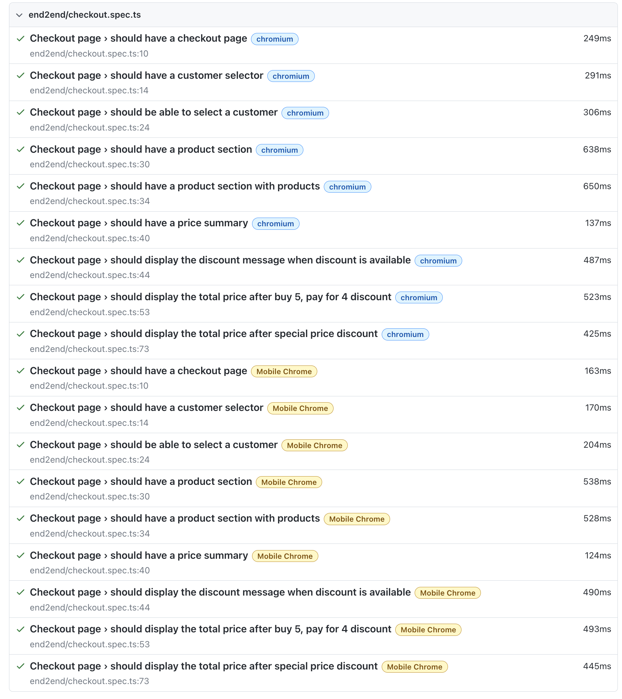
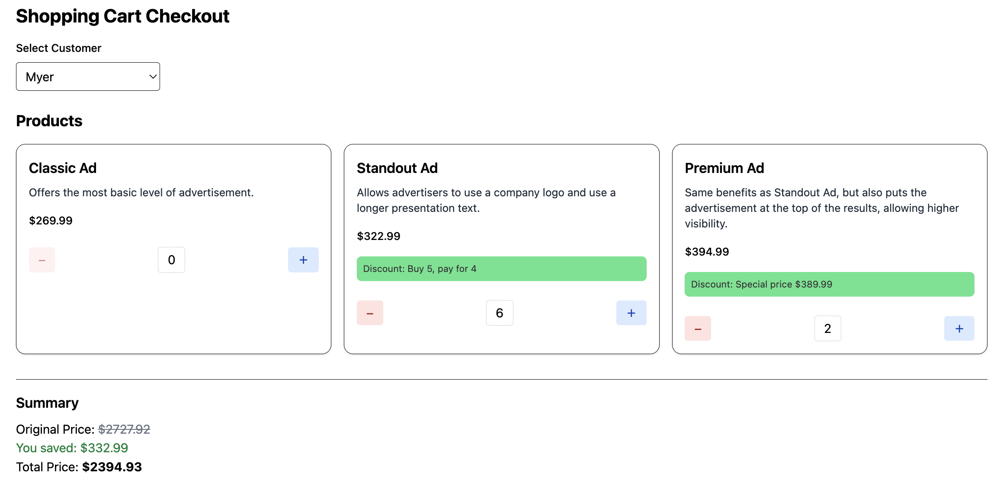

# Code Test for Seek

## 👤 Author: George (Kalok) Cheung

## 💡 Design and Assumptions

This solution was built within a limited timeframe and with practical real-world scenarios in mind.

- It is assumed that both **product catalog** and **customer pricing rules** are fetched from APIs in a production environment.
- The **Customer Context** is responsible for managing the currently selected customer and retrieving their associated pricing rules. If no customer is selected (e.g. anonymous user), a default rule is applied.
- The **Cart Context** is client-side only, and manages:
    - The current items in the shopping cart
    - The calculated total price
    - The total amount saved via discounts
- Pricing logic is centralized in a utility function that applies either “X for Y” or “Special Price” discounts, with validation and testability in mind.
- In a real-world scenario, `fetchProducts` and `fetchCustomerPricingRule` would be served through **AWS API Gateway + Lambda** for scalability and security.
- All pricing and cart logic remains on the client side to keep the UI responsive and decoupled from backend performance.
- The solution is designed with flexibility in mind, making it easy to scale. New products or pricing rules can be added with minimal changes due to the modular design and clean separation of concerns.

> This approach ensures a balance between separation of concerns, performance, and a realistic path to production readiness.

## 🚀 Features

- React 19 with TypeScript
- Vite for fast development and building
- TailwindCSS for styling
- Jest and Playwright for testing
- ESLint and Prettier for code quality
- Husky for git hooks

## 📝 Code Quality

- ESLint is configured for code linting
- Prettier is used for code formatting
- Husky is set up for pre-commit hooks

## 📋 Prerequisites

- Node.js (Latest LTS version recommended)
- npm (comes with Node.js)

## 🛠️ Installation

1. Clone the repository:

```bash
git clone https://github.com/KarlokZhang/seek-code-test.git
cd seek-code-test
```

2. Install dependencies:

```bash
npm install
```

## 🚀 Available Scripts

- `npm run dev` - Start the development server
- `npm run build` - Build the application for production
- `npm run preview` - Preview the production build locally
- `npm run lint` - Run ESLint to check code quality
- `npm run type-check` - Run TypeScript type checking
- `npm run format` - Format code using Prettier
- `npm run format:check` - Check code formatting
- `npm run test` - Run Jest tests
- `npm run test:e2e` - Run Playwright end-to-end tests
- `npm run test:e2e:ui` - Run Playwright tests with UI
- `npm run verify` - Run all checks (lint, type-check, test, format)

## 🏗️ Project Structure

```
src/
├── api/        # API related code
├── components/ # Reusable React components
├── constants/  # Application constants
├── context/    # React context providers
├── data/       # Static data and mock data
├── hooks/      # Custom React hooks
├── sections/   # Page sections and layouts
├── types/      # TypeScript type definitions
└── utils/      # Utility functions
```

## 🧪 Testing

The project uses both Jest for unit testing and Playwright for end-to-end testing:

I have follow [Kent C. Dodds' Testing Trophy](https://kentcdodds.com/blog/the-testing-trophy-and-testing-classifications) methodology:

- ✅ **Static Tests**: ESLint, Prettier, and Husky are used for code formatting and linting.
- ✅ **Unit Tests**: All components and utility functions are tested using Jest.
- ✅ **Integration Tests**: While limited in this code test, two simple integration test cases were written for the fake API calls (`fetchProducts` and `fetchPricingRules`).
- ✅ **End-to-End Tests**: Playwright is used to run E2E tests across both desktop and mobile viewports.

> The focus was on reliability, isolation, and coverage while maintaining speed and developer ergonomics.

- Unit tests are located in `src/test/`
- E2E tests are located in `src/test/playwright/end2end`

### Test Results





## 📸 UI Screenshots


